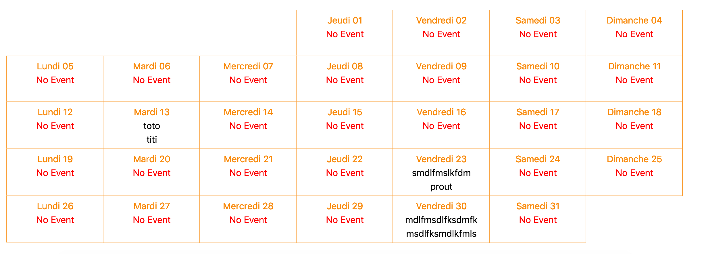

# php-schedule
A simple schedule management with a monthly display with a week by line.


I spend some time to manage this display so i share it because i think i'm not alone in this case !
This project is framework agnostic, there is neither template engine to allow everyone to use this as he would !

- A management page to create and delete event
- Event contains only a label a date and a description
- You are totally free to add some fields to improve behavior

# Pre-requisites

- Having docker
- Having docker-compose

# Start project

- Php-Schedule use a mysql 8 database
- Docker-compose launch an apache, a database and a php-my-admin

```
# start app and bdd
docker-compose up
```
```
# stop app and bdd
docker-compose down -v
```

# Access To application

- http://localhost to access to scedule
- http://localhost:81 to access to mysql


